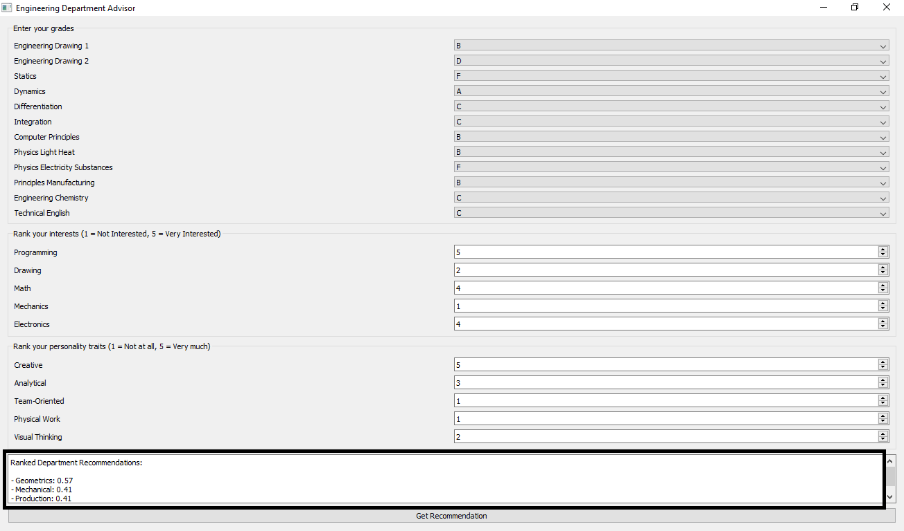

# 🎓 Expert System for Engineering Department Recommendation

An AI-based expert system built using **Prolog** and a **Python GUI**, designed to help engineering students in their preparatory year explore which department best matches their skills, traits, and academic performance.  

---

## Overview
Choosing the right engineering department can be tough for preparatory-year students.  
This project provides a simple interactive tool where students can:  

- Enter their **grades** in preparatory subjects  
- Rate their **skills** and **personal traits**  
- Get a **matching percentage** with each engineering department  

The system then suggests which department might be the best fit, based on logic rules and preferences.

---

## Tech Stack
- **Prolog** → Core expert system & reasoning engine  
- **Python (PyQt)** → Graphical User Interface  
- **AI Concepts** → Rule-based reasoning, knowledge representation  

---

## Demo


---

## Features
- Enter grades, skills, and your personal traits  
- Get department match percentages  
- Simple and intuitive GUI  
- Combines **AI logic** with real-world student decision support  

---

## How to Run
1. Clone the repo:  
   ```bash
   git clone https://github.com/your-username/expert-system-department-recommender.git
   cd expert-system-department-recommender

2. Install swi-prolog from the link: [SWI-Prolog download page](https://www.swi-prolog.org/download/stable)

3. Install dependencies:
   ```bash
   pip install PyQt5, pyswip

4. Run the GUI:
   ```bash
   python advisor_interface.py

---

## 💡 Inspiration
The results weren’t about cutting-edge AI, but about showing how even simple tools can guide students in making important choices, how even the early AI stages were helpful, and where all the tech that we're learning right now started.

